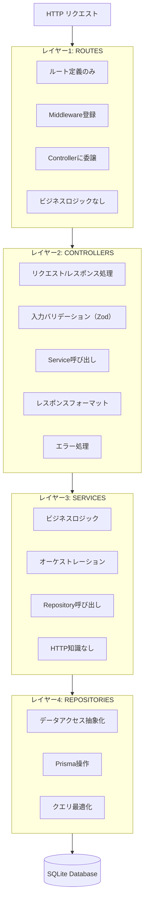

# アーキテクチャ概要 - バックエンドサービス

バックエンドサービスで使用されるLayered Architectureパターンの完全なガイドです。

## プロジェクト概要

**RealWorld (Conduit)** - Medium.comクローンのソーシャルブログプラットフォーム

| 技術 | バージョン | 用途 |
|------|-----------|------|
| **Node.js** | 20.x LTS | JavaScript ランタイム |
| **Express** | 4.x | Web フレームワーク |
| **TypeScript** | 5.x | 型安全性 |
| **Prisma** | 5.x | ORM |
| **SQLite** | 3.x | データベース |

## 目次

- [Layered Architectureパターン](#layered-architectureパターン)
- [リクエストライフサイクル](#リクエストライフサイクル)
- [ディレクトリ構造](#ディレクトリ構造)
- [モジュール構成](#モジュール構成)
- [関心の分離](#関心の分離)

---

## Layered Architectureパターン

### 4つのレイヤー



### このアーキテクチャを使用する理由

**テスト容易性:**
- 各レイヤーを独立してテスト可能
- 依存性を簡単にモック
- 明確なテスト境界

**保守性:**
- 変更が特定のレイヤーに分離される
- ビジネスロジックがHTTP関心事から分離
- バグの場所を簡単に特定

**再利用性:**
- Serviceをroutes、cron jobs、scriptsから使用可能
- Repositoryがデータベース実装を隠蔽
- ビジネスロジックがHTTPに依存しない

**拡張性:**
- 新しいエンドポイント追加が容易
- 従うべき明確なパターン
- 一貫した構造

---

## リクエストライフサイクル

### 完全なフロー例

```typescript
1. HTTP POST /api/users
   ↓
2. ExpressがuserRoutes.tsでルートをマッチ
   ↓
3. Middlewareチェーン実行:
   - SSOMiddleware.verifyLoginStatus (認証)
   - auditMiddleware (コンテキスト追跡)
   ↓
4. Route handlerがcontrollerに委譲:
   router.post('/users', (req, res) => userController.create(req, res))
   ↓
5. Controllerがバリデーション後service呼び出し:
   - Zodで入力検証
   - userService.create(data)呼び出し
   - 成功/エラー処理
   ↓
6. Serviceがビジネスロジック実行:
   - ビジネスルール確認
   - userRepository.create(data)呼び出し
   - 結果を返却
   ↓
7. Repositoryがデータベース操作実行:
   - PrismaService.main.user.create({ data })
   - データベースエラー処理
   - 作成されたユーザーを返却
   ↓
8. レスポンスが逆順で流れる:
   Repository → Service → Controller → Express → クライアント
```

### Middleware実行順序

**重要:** Middlewareは登録順に実行されます

```typescript
app.use(Sentry.Handlers.requestHandler());  // 1. Sentry追跡（最初）
app.use(express.json());                     // 2. Bodyパース
app.use(express.urlencoded({ extended: true })); // 3. URLエンコード
app.use(cookieParser());                     // 4. Cookieパース
app.use(SSOMiddleware.initialize());         // 5. 認証初期化
// ... ここでroutes登録
app.use(auditMiddleware);                    // 6. 監査（グローバルの場合）
app.use(errorBoundary);                      // 7. エラーハンドラー（最後）
app.use(Sentry.Handlers.errorHandler());     // 8. Sentryエラー（最後）
```

**ルール:** エラーハンドラーは必ずroutesの後に登録すること！

---

## ディレクトリ構造

### プロジェクト全体構造

```
backend/
├── src/
│   ├── routes/                # ルート定義
│   ├── controllers/           # コントローラー
│   ├── services/              # ビジネスロジック
│   ├── repositories/          # データアクセス
│   ├── middleware/            # ミドルウェア
│   │   ├── auth.ts            # 認証ミドルウェア
│   │   ├── errorHandler.ts    # エラーハンドリング
│   │   └── validation.ts      # バリデーション
│   ├── lib/                   # ユーティリティ
│   │   ├── prisma.ts          # Prisma クライアント
│   │   └── jwt.ts             # JWT ユーティリティ
│   ├── types/                 # 型定義
│   └── index.ts               # エントリーポイント
├── prisma/
│   ├── schema.prisma          # データベーススキーマ
│   └── migrations/            # マイグレーション
├── tsconfig.json
└── package.json
```

### Controllersディレクトリ

**目的:** HTTPリクエスト/レスポンス関心事の処理

**内容:**
- `BaseController.ts` - 共通メソッドを持つ基底クラス
- `{Feature}Controller.ts` - 機能別controllers

**命名:** PascalCase + Controller

**責任:**
- リクエストパラメータのパース
- 入力バリデーション（Zod）
- 適切なserviceメソッド呼び出し
- レスポンスフォーマット
- エラー処理（BaseController経由）
- HTTPステータスコード設定

### Servicesディレクトリ

**目的:** ビジネスロジックとオーケストレーション

**内容:**
- `{feature}Service.ts` - 機能ビジネスロジック

**命名:** camelCase + Service（またはPascalCase + Service）

**責任:**
- ビジネスルール実装
- 複数のrepositories調整
- トランザクション管理
- ビジネスバリデーション
- HTTP知識なし（Request/Response型）

### Repositoriesディレクトリ

**目的:** データアクセス抽象化

**内容:**
- `{Entity}Repository.ts` - エンティティのデータベース操作

**命名:** PascalCase + Repository

**責任:**
- Prismaクエリ操作
- クエリ最適化
- データベースエラー処理
- キャッシングレイヤー
- Prisma実装詳細の隠蔽

**現在のギャップ:** 1つのrepositoryのみ存在（WorkflowRepository）

### Routesディレクトリ

**目的:** ルート登録のみ

**内容:**
- `{feature}Routes.ts` - 機能のためのExpress router

**命名:** camelCase + Routes

**責任:**
- Expressにroutesを登録
- Middleware適用
- Controllersに委譲
- **ビジネスロジックなし！**

### Middlewareディレクトリ

**目的:** 横断的関心事

**内容:**
- 認証middleware
- Audit middleware
- Error boundaries
- Validation middleware
- カスタムmiddleware

**命名:** camelCase

**タイプ:**
- リクエスト処理（ハンドラー前）
- レスポンス処理（ハンドラー後）
- エラー処理（error boundary）

### Configディレクトリ

**目的:** 設定管理

**内容:**
- `unifiedConfig.ts` - タイプセーフ設定
- 環境別設定

**パターン:** 単一信頼できるソース

### Typesディレクトリ

**目的:** TypeScript型定義

**内容:**
- `{feature}.types.ts` - 機能別型
- DTOs（Data Transfer Objects）
- Request/Response型
- ドメインモデル

---

## モジュール構成

### 機能ベース構成

大規模な機能の場合サブディレクトリを使用:

```
src/workflow/
├── core/              # コアエンジン
├── services/          # Workflow専用services
├── actions/           # システムアクション
├── models/            # ドメインモデル
├── validators/        # Workflowバリデーション
└── utils/             # Workflowユーティリティ
```

**使用タイミング:**
- 機能に5つ以上のファイルがある場合
- 明確なサブドメインが存在する場合
- 論理的グループ化が明確性を高める場合

### フラット構成

シンプルな機能の場合:

```
src/
├── controllers/UserController.ts
├── services/userService.ts
├── routes/userRoutes.ts
└── repositories/UserRepository.ts
```

**使用タイミング:**
- シンプルな機能（< 5ファイル）
- 明確なサブドメインなし
- フラット構造がより明確な場合

---

## 関心の分離

### 何をどこに置くか

**Routesレイヤー:**
- ✅ ルート定義
- ✅ Middleware登録
- ✅ Controller委譲
- ❌ ビジネスロジック
- ❌ データベース操作
- ❌ バリデーションロジック（validatorまたはcontrollerにあるべき）

**Controllersレイヤー:**
- ✅ リクエストパース（params、body、query）
- ✅ 入力バリデーション（Zod）
- ✅ Service呼び出し
- ✅ レスポンスフォーマット
- ✅ エラー処理
- ❌ ビジネスロジック
- ❌ データベース操作

**Servicesレイヤー:**
- ✅ ビジネスロジック
- ✅ ビジネスルール適用
- ✅ オーケストレーション（複数repos）
- ✅ トランザクション管理
- ❌ HTTP関心事（Request/Response）
- ❌ 直接Prisma呼び出し（repositories使用）

**Repositoriesレイヤー:**
- ✅ Prisma操作
- ✅ クエリ構築
- ✅ データベースエラー処理
- ✅ キャッシング
- ❌ ビジネスロジック
- ❌ HTTP関心事

### 例示: ユーザー作成

**Route:**
```typescript
router.post('/users',
    SSOMiddleware.verifyLoginStatus,
    auditMiddleware,
    (req, res) => userController.create(req, res)
);
```

**Controller:**
```typescript
async create(req: Request, res: Response): Promise<void> {
    try {
        const validated = createUserSchema.parse(req.body);
        const user = await this.userService.create(validated);
        this.handleSuccess(res, user, 'User created');
    } catch (error) {
        this.handleError(error, res, 'create');
    }
}
```

**Service:**
```typescript
async create(data: CreateUserDTO): Promise<User> {
    // ビジネスルール: メールが既に存在するか確認
    const existing = await this.userRepository.findByEmail(data.email);
    if (existing) throw new ConflictError('Email already exists');

    // ユーザー作成
    return await this.userRepository.create(data);
}
```

**Repository:**
```typescript
async create(data: CreateUserDTO): Promise<User> {
    return PrismaService.main.user.create({ data });
}

async findByEmail(email: string): Promise<User | null> {
    return PrismaService.main.user.findUnique({ where: { email } });
}
```

**注目:** 各レイヤーが明確で区別された責任を持ちます！

---

**関連ファイル:**
- [SKILL.md](SKILL.md) - メインガイド
- [routing-and-controllers.md](routing-and-controllers.md) - Routesとcontrollersの詳細
- [services-and-repositories.md](services-and-repositories.md) - Serviceとrepositoryパターン
