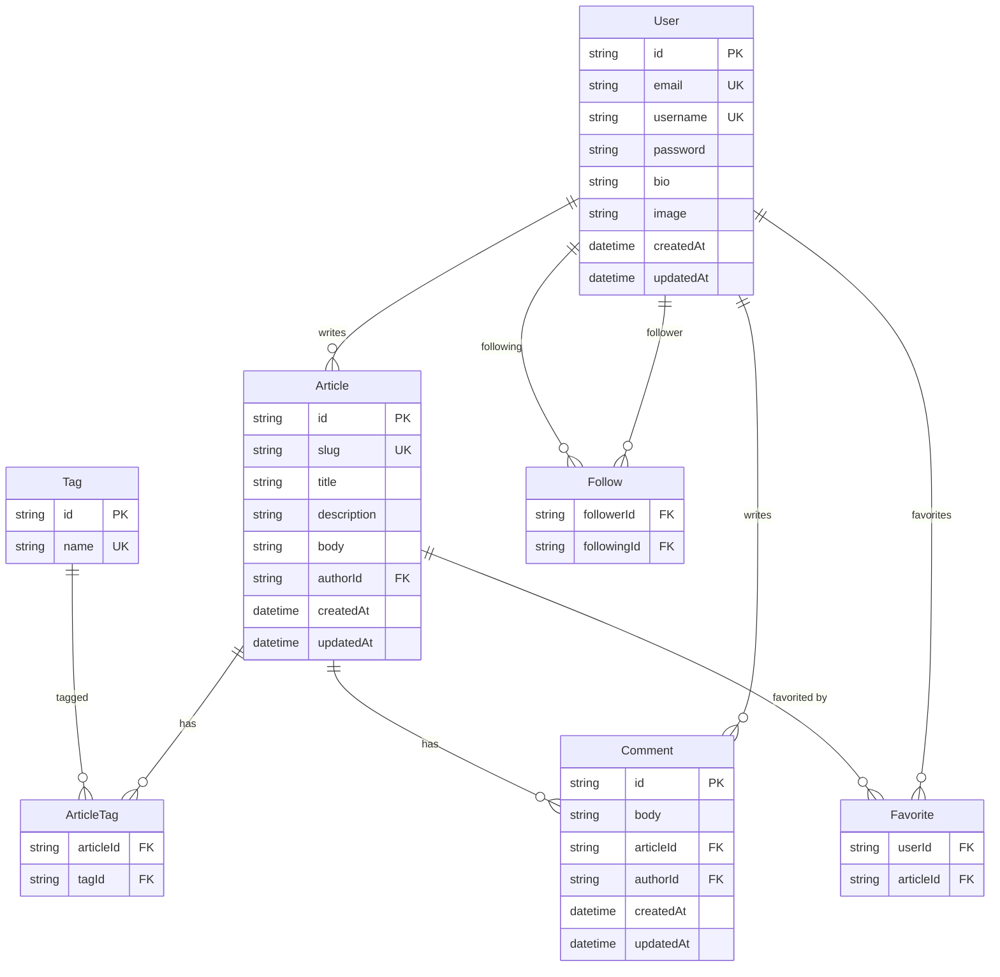

# データベースパターン - Prisma モベストプラクティス

バックエンドサービスでPrismaを使用したデータベースアクセスパターンの完全なガイドです。

## RealWorld データモデル

### エンティティ関係図



## 目次

- [PrismaService使用法](#prismaservice使用法)
- [Prismaスキーマ](#prismaスキーマ)
- [Repositoryパターン](#repositoryパターン)
- [トランザクションパターン](#トランザクションパターン)
- [クエリ最適化](#クエリ最適化)
- [N+1クエリ防止](#n1クエリ防止)
- [エラー処理](#エラー処理)

---

## PrismaService使用法

### 基本パターン

```typescript
import { prisma } from '../lib/prisma';

// Prismaクライアントを使用
const users = await prisma.user.findMany();
```

### 初期化

```typescript
// lib/prisma.ts
import { PrismaClient } from '@prisma/client';

export const prisma = new PrismaClient();
```

---

## Prismaスキーマ

```prisma
// prisma/schema.prisma

generator client {
  provider = "prisma-client-js"
}

datasource db {
  provider = "sqlite"
  url      = env("DATABASE_URL")
}

model User {
  id        String   @id @default(uuid())
  email     String   @unique
  username  String   @unique
  password  String
  bio       String?
  image     String?
  createdAt DateTime @default(now())
  updatedAt DateTime @updatedAt

  // Relations
  articles   Article[]
  comments   Comment[]
  favorites  Favorite[]
  followers  Follow[]   @relation("Following")
  following  Follow[]   @relation("Follower")
}

model Article {
  id          String   @id @default(uuid())
  slug        String   @unique
  title       String
  description String
  body        String
  createdAt   DateTime @default(now())
  updatedAt   DateTime @updatedAt

  // Relations
  author    User       @relation(fields: [authorId], references: [id], onDelete: Cascade)
  authorId  String
  tags      ArticleTag[]
  comments  Comment[]
  favorites Favorite[]

  @@index([authorId])
  @@index([createdAt])
}

model Tag {
  id       String       @id @default(uuid())
  name     String       @unique
  articles ArticleTag[]
}

model ArticleTag {
  article   Article @relation(fields: [articleId], references: [id], onDelete: Cascade)
  articleId String
  tag       Tag     @relation(fields: [tagId], references: [id], onDelete: Cascade)
  tagId     String

  @@id([articleId, tagId])
}

model Comment {
  id        String   @id @default(uuid())
  body      String
  createdAt DateTime @default(now())
  updatedAt DateTime @updatedAt

  // Relations
  article   Article @relation(fields: [articleId], references: [id], onDelete: Cascade)
  articleId String
  author    User    @relation(fields: [authorId], references: [id], onDelete: Cascade)
  authorId  String

  @@index([articleId])
}

model Favorite {
  user      User    @relation(fields: [userId], references: [id], onDelete: Cascade)
  userId    String
  article   Article @relation(fields: [articleId], references: [id], onDelete: Cascade)
  articleId String

  @@id([userId, articleId])
}

model Follow {
  follower    User   @relation("Follower", fields: [followerId], references: [id], onDelete: Cascade)
  followerId  String
  following   User   @relation("Following", fields: [followingId], references: [id], onDelete: Cascade)
  followingId String

  @@id([followerId, followingId])
}
```

---

## Repositoryパターン

### Repositoryを使用すべき場合

✅ **次の場合repositoriesを使用:**
- JOINs/includeがある複雑なクエリ
- 複数の場所で使用されるクエリ
- キャッシングレイヤーが必要な場合
- テストのためにモックしたい場合

❌ **次の場合repositoriesを省略:**
- シンプルな一回限りのクエリ
- プロトタイピング（後でリファクタリング可能）

### Repositoryテンプレート

```typescript
export class UserRepository {
    async findById(id: string): Promise<User | null> {
        return PrismaService.main.user.findUnique({
            where: { id },
            include: { profile: true },
        });
    }

    async findActive(): Promise<User[]> {
        return PrismaService.main.user.findMany({
            where: { isActive: true },
            orderBy: { createdAt: 'desc' },
        });
    }

    async create(data: Prisma.UserCreateInput): Promise<User> {
        return PrismaService.main.user.create({ data });
    }
}
```

---

## トランザクションパターン

### 単純トランザクション

```typescript
const result = await PrismaService.main.$transaction(async (tx) => {
    const user = await tx.user.create({ data: userData });
    const profile = await tx.userProfile.create({ data: { userId: user.id } });
    return { user, profile };
});
```

### インタラクティブトランザクション

```typescript
const result = await PrismaService.main.$transaction(
    async (tx) => {
        const user = await tx.user.findUnique({ where: { id } });
        if (!user) throw new Error('User not found');

        return await tx.user.update({
            where: { id },
            data: { lastLogin: new Date() },
        });
    },
    {
        maxWait: 5000,
        timeout: 10000,
    }
);
```

---

## クエリ最適化

### selectでフィールドを制限

```typescript
// ❌ すべてのフィールドを取得
const users = await PrismaService.main.user.findMany();

// ✅ 必要なフィールドのみ取得
const users = await PrismaService.main.user.findMany({
    select: {
        id: true,
        email: true,
        profile: { select: { firstName: true, lastName: true } },
    },
});
```

### includeを慎重に使用

```typescript
// ❌ 過度なincludes
const user = await PrismaService.main.user.findUnique({
    where: { id },
    include: {
        profile: true,
        posts: { include: { comments: true } },
        workflows: { include: { steps: { include: { actions: true } } } },
    },
});

// ✅ 必要なものだけinclude
const user = await PrismaService.main.user.findUnique({
    where: { id },
    include: { profile: true },
});
```

---

## N+1クエリ防止

### 問題: N+1クエリ

```typescript
// ❌ N+1クエリ問題
const users = await PrismaService.main.user.findMany(); // 1つのクエリ

for (const user of users) {
    // Nクエリ（ユーザーごとに1つ）
    const profile = await PrismaService.main.userProfile.findUnique({
        where: { userId: user.id },
    });
}
```

### 解決策: includeまたはバッチングを使用

```typescript
// ✅ includeで単一クエリ
const users = await PrismaService.main.user.findMany({
    include: { profile: true },
});

// ✅ またはバッチクエリ
const userIds = users.map(u => u.id);
const profiles = await PrismaService.main.userProfile.findMany({
    where: { userId: { in: userIds } },
});
```

---

## エラー処理

### Prismaエラータイプ

```typescript
import { Prisma } from '@prisma/client';

try {
    await PrismaService.main.user.create({ data });
} catch (error) {
    if (error instanceof Prisma.PrismaClientKnownRequestError) {
        // ユニーク制約違反
        if (error.code === 'P2002') {
            throw new ConflictError('Email already exists');
        }

        // 外部キー制約
        if (error.code === 'P2003') {
            throw new ValidationError('Invalid reference');
        }

        // レコード見つからない
        if (error.code === 'P2025') {
            throw new NotFoundError('Record not found');
        }
    }

    // 不明なエラー
    Sentry.captureException(error);
    throw error;
}
```

---

**関連ファイル:**
- [SKILL.md](SKILL.md)
- [services-and-repositories.md](services-and-repositories.md)
- [async-and-errors.md](async-and-errors.md)
