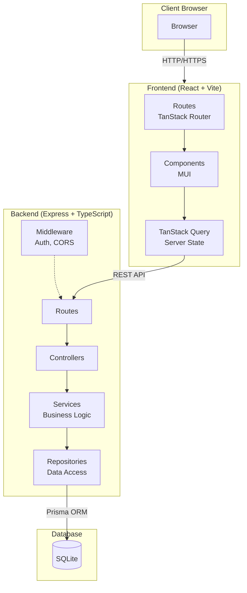
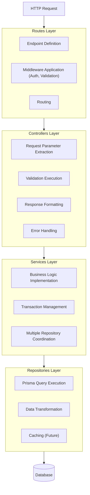
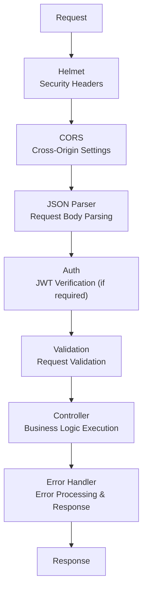
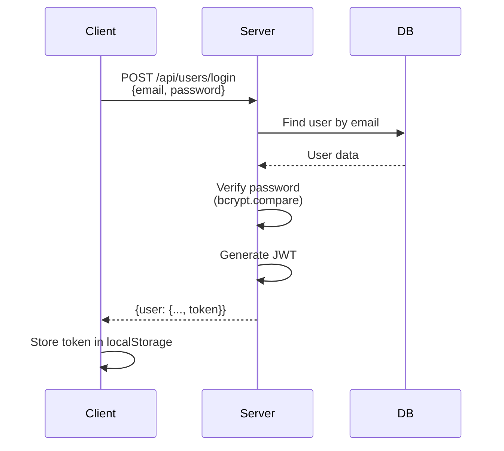
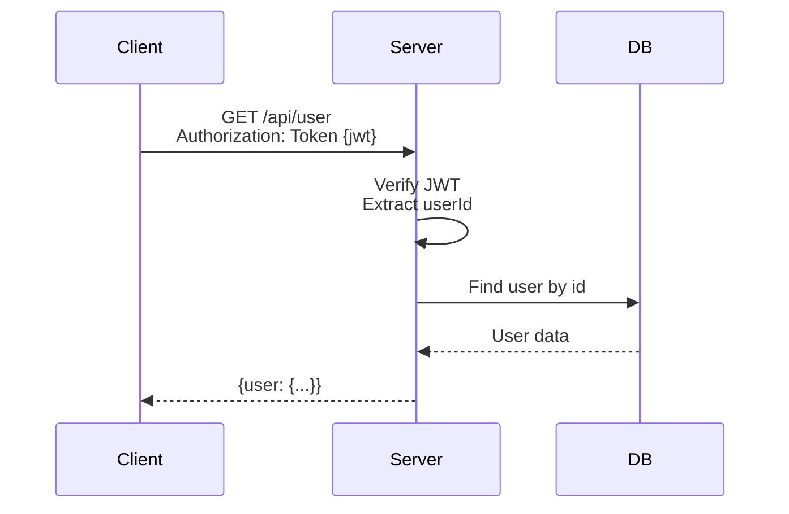

# RealWorld (Conduit) - Architecture Design Document

## 1. System Overview

### 1.1 Architecture Diagram



### 1.2 Communication Between Components

| Communication Path | Protocol | Format |
|-------------------|----------|--------|
| Browser ↔ Frontend | HTTP/HTTPS | HTML/JS/CSS |
| Frontend ↔ Backend | REST API | JSON |
| Backend ↔ Database | Prisma Client | SQL |

---

## 2. Backend Architecture

### 2.1 Layered Architecture



### 2.2 Layer Responsibilities

| Layer | Responsibility | Dependencies |
|-------|---------------|--------------|
| **Routes** | Endpoint definition, Middleware application | Controllers |
| **Controllers** | HTTP processing, Validation, Response | Services |
| **Services** | Business logic | Repositories |
| **Repositories** | Data access | Prisma |

### 2.3 Middleware Stack



---

## 3. Frontend Architecture

### 3.1 Feature-Based Module Structure

```
src/
├── features/                    # Feature Modules
│   ├── auth/                    # Authentication Feature
│   │   ├── components/          # Auth-related Components
│   │   ├── hooks/               # Auth Hooks
│   │   ├── api/                 # Auth API Calls
│   │   └── types.ts             # Type Definitions
│   │
│   ├── articles/                # Articles Feature
│   │   ├── components/
│   │   ├── hooks/
│   │   ├── api/
│   │   └── types.ts
│   │
│   ├── comments/                # Comments Feature
│   ├── profiles/                # Profiles Feature
│   └── tags/                    # Tags Feature
│
├── components/                  # Shared Components
│   ├── layout/
│   │   ├── Header.tsx
│   │   ├── Footer.tsx
│   │   └── Layout.tsx
│   └── ui/
│       ├── Loading.tsx
│       ├── ErrorMessage.tsx
│       └── Pagination.tsx
│
├── hooks/                       # Shared Hooks
│   ├── useAuth.ts
│   └── useLocalStorage.ts
│
├── lib/                         # Utilities
│   ├── api/
│   │   └── client.ts            # API Client
│   └── utils/
│       └── formatDate.ts
│
└── routes/                      # TanStack Router
    ├── __root.tsx
    ├── index.tsx
    ├── login.tsx
    ├── register.tsx
    └── ...
```

### 3.2 State Management Strategy

| State Type | Management Method | Examples |
|------------|-------------------|----------|
| **Server State** | TanStack Query | Article list, User info |
| **Auth State** | Context + localStorage | Login status, JWT |
| **UI State** | React State | Modal, Form |
| **URL State** | TanStack Router | Filters, Page number |

### 3.3 Data Fetching Pattern

```typescript
// useSuspenseQuery Pattern
function ArticleList() {
  const { data: articles } = useSuspenseQuery({
    queryKey: ['articles'],
    queryFn: () => api.articles.list()
  });

  return <ArticleListView articles={articles} />;
}

// Suspense Boundary
function ArticlesPage() {
  return (
    <Suspense fallback={<Loading />}>
      <ArticleList />
    </Suspense>
  );
}
```

---

## 4. Data Model (ERD)

### 4.1 Entity Relationship Diagram


### 4.2 Prisma Schema

```prisma
// prisma/schema.prisma

generator client {
  provider = "prisma-client-js"
}

datasource db {
  provider = "sqlite"
  url      = env("DATABASE_URL")
}

model User {
  id        String   @id @default(uuid())
  email     String   @unique
  username  String   @unique
  password  String
  bio       String?
  image     String?
  createdAt DateTime @default(now())
  updatedAt DateTime @updatedAt

  // Relations
  articles   Article[]
  comments   Comment[]
  favorites  Favorite[]
  followers  Follow[]   @relation("Following")
  following  Follow[]   @relation("Follower")
}

model Article {
  id          String   @id @default(uuid())
  slug        String   @unique
  title       String
  description String
  body        String
  createdAt   DateTime @default(now())
  updatedAt   DateTime @updatedAt

  // Relations
  author    User       @relation(fields: [authorId], references: [id], onDelete: Cascade)
  authorId  String
  tags      ArticleTag[]
  comments  Comment[]
  favorites Favorite[]

  @@index([authorId])
  @@index([createdAt])
}

model Tag {
  id       String       @id @default(uuid())
  name     String       @unique
  articles ArticleTag[]
}

model ArticleTag {
  article   Article @relation(fields: [articleId], references: [id], onDelete: Cascade)
  articleId String
  tag       Tag     @relation(fields: [tagId], references: [id], onDelete: Cascade)
  tagId     String

  @@id([articleId, tagId])
}

model Comment {
  id        String   @id @default(uuid())
  body      String
  createdAt DateTime @default(now())
  updatedAt DateTime @updatedAt

  // Relations
  article   Article @relation(fields: [articleId], references: [id], onDelete: Cascade)
  articleId String
  author    User    @relation(fields: [authorId], references: [id], onDelete: Cascade)
  authorId  String

  @@index([articleId])
}

model Favorite {
  user      User    @relation(fields: [userId], references: [id], onDelete: Cascade)
  userId    String
  article   Article @relation(fields: [articleId], references: [id], onDelete: Cascade)
  articleId String

  @@id([userId, articleId])
}

model Follow {
  follower    User   @relation("Follower", fields: [followerId], references: [id], onDelete: Cascade)
  followerId  String
  following   User   @relation("Following", fields: [followingId], references: [id], onDelete: Cascade)
  followingId String

  @@id([followerId, followingId])
}
```

---

## 5. Authentication Flow

### 5.1 JWT Authentication Sequence



### 5.2 Authenticated Request



### 5.3 Token Structure

```json
// JWT Payload
{
  "userId": "uuid-string",
  "iat": 1234567890,
  "exp": 1234567890
}
```

---

## 6. Error Handling

### 6.1 Error Response Format

```json
{
  "errors": {
    "body": ["can't be empty"]
  }
}
```

### 6.2 HTTP Status Codes

| Code | Meaning | Usage |
|------|---------|-------|
| 200 | OK | Success (GET, PUT) |
| 201 | Created | Success (POST) |
| 204 | No Content | Success (DELETE) |
| 400 | Bad Request | Validation error |
| 401 | Unauthorized | Authentication required |
| 403 | Forbidden | Insufficient permissions |
| 404 | Not Found | Resource not found |
| 422 | Unprocessable Entity | Validation error |
| 500 | Internal Server Error | Server error |

### 6.3 Backend Error Handling

```typescript
// middleware/errorHandler.ts
export function errorHandler(
  err: Error,
  req: Request,
  res: Response,
  next: NextFunction
) {
  if (err instanceof ValidationError) {
    return res.status(422).json({
      errors: err.errors
    });
  }

  if (err instanceof UnauthorizedError) {
    return res.status(401).json({
      errors: { message: ['Unauthorized'] }
    });
  }

  // Send error to Sentry
  Sentry.captureException(err);

  return res.status(500).json({
    errors: { message: ['Internal server error'] }
  });
}
```

---

## 7. Performance Optimization

### 7.1 Backend

| Optimization | Implementation |
|--------------|----------------|
| **Database Indexes** | Index frequently queried fields |
| **N+1 Problem Prevention** | Batch fetch related data with Prisma include |
| **Pagination** | Limit data retrieval with offset/limit |

### 7.2 Frontend

| Optimization | Implementation |
|--------------|----------------|
| **Code Splitting** | React.lazy + Suspense |
| **Caching** | TanStack Query staleTime configuration |
| **Memoization** | React.memo, useMemo, useCallback |
| **Bundle Optimization** | Vite chunk splitting |

---

## 8. Security Measures

### 8.1 Security Implementations

| Threat | Countermeasure |
|--------|----------------|
| **XSS** | React escaping, CSP headers |
| **CSRF** | SameSite Cookie (future) |
| **SQL Injection** | Prisma ORM (parameterized queries) |
| **Brute Force** | Rate Limiting (future) |
| **Credential Leakage** | bcrypt hashing, HTTPS |

### 8.2 Security Headers (Helmet)

```typescript
app.use(helmet({
  contentSecurityPolicy: {
    directives: {
      defaultSrc: ["'self'"],
      styleSrc: ["'self'", "'unsafe-inline'"],
      scriptSrc: ["'self'"],
      imgSrc: ["'self'", "data:", "https:"]
    }
  }
}));
```
