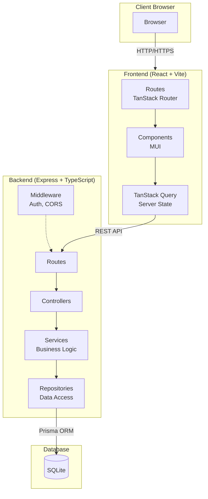
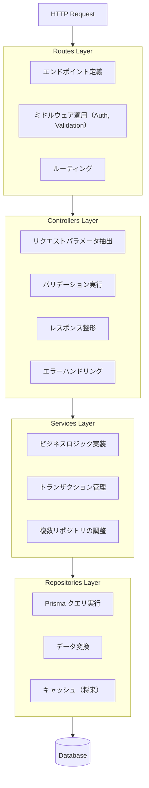
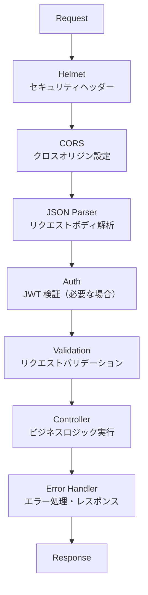
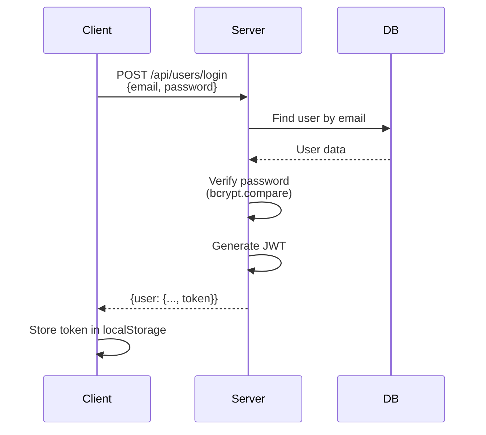
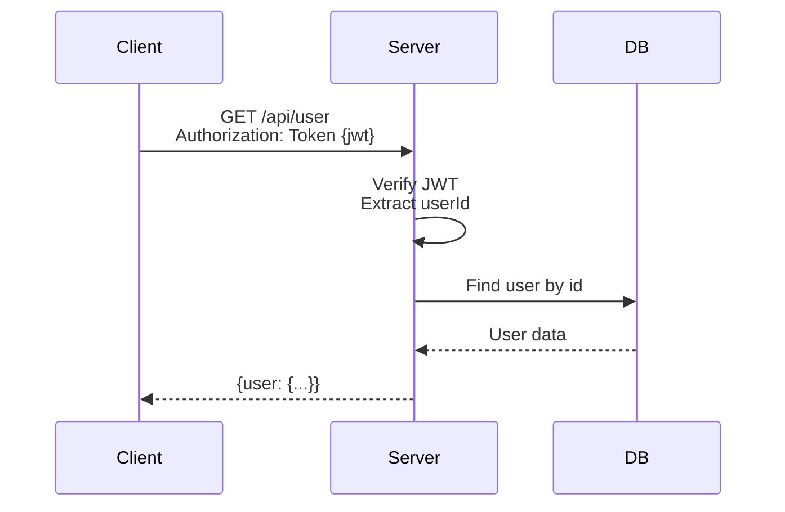

# RealWorld (Conduit) - アーキテクチャ設計書

## 1. システム概要

### 1.1 アーキテクチャ図



### 1.2 コンポーネント間の通信

| 通信経路 | プロトコル | 形式 |
|---------|-----------|------|
| Browser ↔ Frontend | HTTP/HTTPS | HTML/JS/CSS |
| Frontend ↔ Backend | REST API | JSON |
| Backend ↔ Database | Prisma Client | SQL |

---

## 2. バックエンドアーキテクチャ

### 2.1 レイヤードアーキテクチャ



### 2.2 各レイヤーの責務

| レイヤー | 責務 | 依存関係 |
|---------|------|---------|
| **Routes** | エンドポイント定義、ミドルウェア適用 | Controllers |
| **Controllers** | HTTP 処理、バリデーション、レスポンス | Services |
| **Services** | ビジネスロジック | Repositories |
| **Repositories** | データアクセス | Prisma |

### 2.3 ミドルウェアスタック



---

## 3. フロントエンドアーキテクチャ

### 3.1 機能ベースモジュール構成

```
src/
├── features/                    # 機能モジュール
│   ├── auth/                    # 認証機能
│   │   ├── components/          # 認証関連コンポーネント
│   │   ├── hooks/               # 認証フック
│   │   ├── api/                 # 認証 API 呼び出し
│   │   └── types.ts             # 型定義
│   │
│   ├── articles/                # 記事機能
│   │   ├── components/
│   │   ├── hooks/
│   │   ├── api/
│   │   └── types.ts
│   │
│   ├── comments/                # コメント機能
│   ├── profiles/                # プロフィール機能
│   └── tags/                    # タグ機能
│
├── components/                  # 共通コンポーネント
│   ├── layout/
│   │   ├── Header.tsx
│   │   ├── Footer.tsx
│   │   └── Layout.tsx
│   └── ui/
│       ├── Loading.tsx
│       ├── ErrorMessage.tsx
│       └── Pagination.tsx
│
├── hooks/                       # 共通フック
│   ├── useAuth.ts
│   └── useLocalStorage.ts
│
├── lib/                         # ユーティリティ
│   ├── api/
│   │   └── client.ts            # API クライアント
│   └── utils/
│       └── formatDate.ts
│
└── routes/                      # TanStack Router
    ├── __root.tsx
    ├── index.tsx
    ├── login.tsx
    ├── register.tsx
    └── ...
```

### 3.2 状態管理戦略

| 状態の種類 | 管理方法 | 例 |
|-----------|---------|-----|
| **サーバー状態** | TanStack Query | 記事一覧、ユーザー情報 |
| **認証状態** | Context + localStorage | ログイン状態、JWT |
| **UI 状態** | React State | モーダル、フォーム |
| **URL 状態** | TanStack Router | フィルター、ページ番号 |

### 3.3 データフェッチパターン

```typescript
// useSuspenseQuery パターン
function ArticleList() {
  const { data: articles } = useSuspenseQuery({
    queryKey: ['articles'],
    queryFn: () => api.articles.list()
  });

  return <ArticleListView articles={articles} />;
}

// Suspense 境界
function ArticlesPage() {
  return (
    <Suspense fallback={<Loading />}>
      <ArticleList />
    </Suspense>
  );
}
```

---

## 4. データモデル（ERD）

### 4.1 エンティティ関係図


### 4.2 Prisma スキーマ

```prisma
// prisma/schema.prisma

generator client {
  provider = "prisma-client-js"
}

datasource db {
  provider = "sqlite"
  url      = env("DATABASE_URL")
}

model User {
  id        String   @id @default(uuid())
  email     String   @unique
  username  String   @unique
  password  String
  bio       String?
  image     String?
  createdAt DateTime @default(now())
  updatedAt DateTime @updatedAt

  // Relations
  articles   Article[]
  comments   Comment[]
  favorites  Favorite[]
  followers  Follow[]   @relation("Following")
  following  Follow[]   @relation("Follower")
}

model Article {
  id          String   @id @default(uuid())
  slug        String   @unique
  title       String
  description String
  body        String
  createdAt   DateTime @default(now())
  updatedAt   DateTime @updatedAt

  // Relations
  author    User       @relation(fields: [authorId], references: [id], onDelete: Cascade)
  authorId  String
  tags      ArticleTag[]
  comments  Comment[]
  favorites Favorite[]

  @@index([authorId])
  @@index([createdAt])
}

model Tag {
  id       String       @id @default(uuid())
  name     String       @unique
  articles ArticleTag[]
}

model ArticleTag {
  article   Article @relation(fields: [articleId], references: [id], onDelete: Cascade)
  articleId String
  tag       Tag     @relation(fields: [tagId], references: [id], onDelete: Cascade)
  tagId     String

  @@id([articleId, tagId])
}

model Comment {
  id        String   @id @default(uuid())
  body      String
  createdAt DateTime @default(now())
  updatedAt DateTime @updatedAt

  // Relations
  article   Article @relation(fields: [articleId], references: [id], onDelete: Cascade)
  articleId String
  author    User    @relation(fields: [authorId], references: [id], onDelete: Cascade)
  authorId  String

  @@index([articleId])
}

model Favorite {
  user      User    @relation(fields: [userId], references: [id], onDelete: Cascade)
  userId    String
  article   Article @relation(fields: [articleId], references: [id], onDelete: Cascade)
  articleId String

  @@id([userId, articleId])
}

model Follow {
  follower    User   @relation("Follower", fields: [followerId], references: [id], onDelete: Cascade)
  followerId  String
  following   User   @relation("Following", fields: [followingId], references: [id], onDelete: Cascade)
  followingId String

  @@id([followerId, followingId])
}
```

---

## 5. 認証フロー

### 5.1 JWT 認証シーケンス



### 5.2 認証済みリクエスト



### 5.3 トークン構造

```json
// JWT Payload
{
  "userId": "uuid-string",
  "iat": 1234567890,
  "exp": 1234567890
}
```

---

## 6. エラーハンドリング

### 6.1 エラーレスポンス形式

```json
{
  "errors": {
    "body": ["can't be empty"]
  }
}
```

### 6.2 HTTP ステータスコード

| コード | 意味 | 使用場面 |
|--------|------|---------|
| 200 | OK | 成功（GET, PUT） |
| 201 | Created | 成功（POST） |
| 204 | No Content | 成功（DELETE） |
| 400 | Bad Request | バリデーションエラー |
| 401 | Unauthorized | 認証必須 |
| 403 | Forbidden | 権限不足 |
| 404 | Not Found | リソースなし |
| 422 | Unprocessable Entity | バリデーションエラー |
| 500 | Internal Server Error | サーバーエラー |

### 6.3 バックエンドエラーハンドリング

```typescript
// middleware/errorHandler.ts
export function errorHandler(
  err: Error,
  req: Request,
  res: Response,
  next: NextFunction
) {
  if (err instanceof ValidationError) {
    return res.status(422).json({
      errors: err.errors
    });
  }

  if (err instanceof UnauthorizedError) {
    return res.status(401).json({
      errors: { message: ['Unauthorized'] }
    });
  }

  // Sentry にエラー送信
  Sentry.captureException(err);

  return res.status(500).json({
    errors: { message: ['Internal server error'] }
  });
}
```

---

## 7. パフォーマンス最適化

### 7.1 バックエンド

| 最適化 | 実装方法 |
|--------|---------|
| **データベースインデックス** | 頻繁にクエリされるフィールドにインデックス |
| **N+1 問題回避** | Prisma の include で関連データを一括取得 |
| **ページネーション** | offset/limit でデータ取得を制限 |

### 7.2 フロントエンド

| 最適化 | 実装方法 |
|--------|---------|
| **コード分割** | React.lazy + Suspense |
| **キャッシュ** | TanStack Query の staleTime 設定 |
| **メモ化** | React.memo, useMemo, useCallback |
| **バンドル最適化** | Vite のチャンク分割 |

---

## 8. セキュリティ対策

### 8.1 実装するセキュリティ対策

| 脅威 | 対策 |
|------|------|
| **XSS** | React のエスケープ、CSP ヘッダー |
| **CSRF** | SameSite Cookie（将来） |
| **SQL Injection** | Prisma ORM（パラメータ化クエリ） |
| **Brute Force** | Rate Limiting（将来） |
| **認証情報漏洩** | bcrypt ハッシュ、HTTPS |

### 8.2 セキュリティヘッダー（Helmet）

```typescript
app.use(helmet({
  contentSecurityPolicy: {
    directives: {
      defaultSrc: ["'self'"],
      styleSrc: ["'self'", "'unsafe-inline'"],
      scriptSrc: ["'self'"],
      imgSrc: ["'self'", "data:", "https:"]
    }
  }
}));
```
