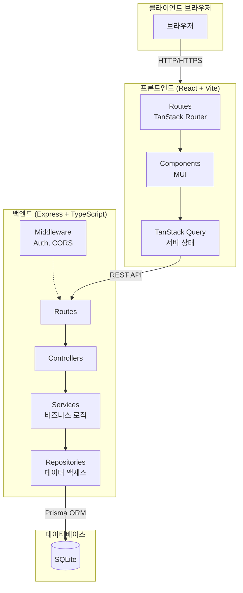
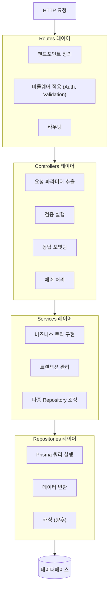
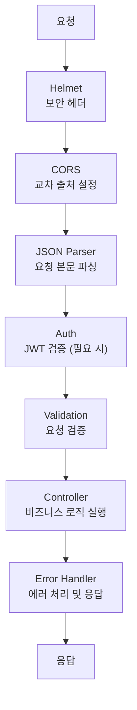
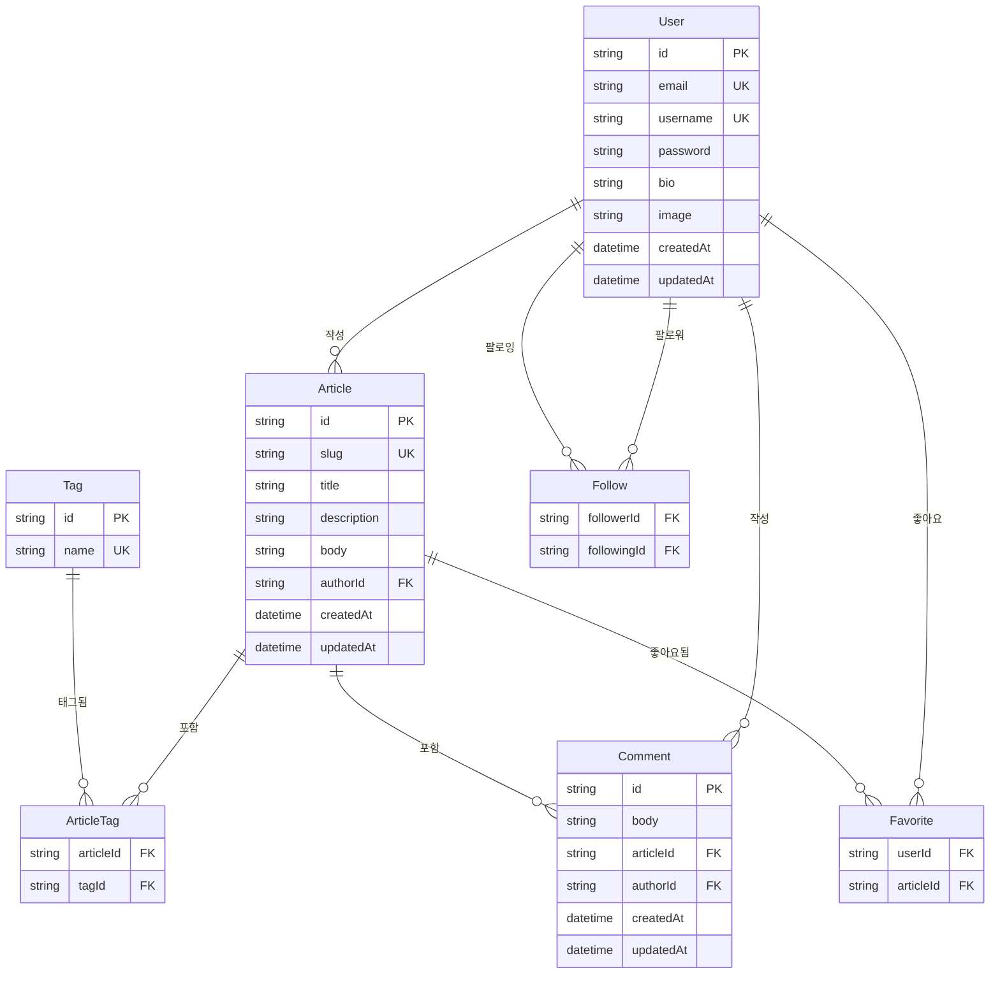
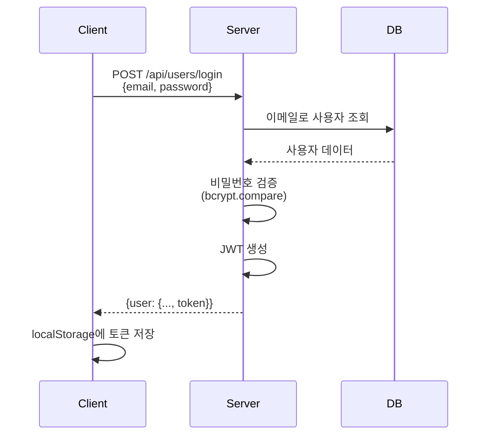
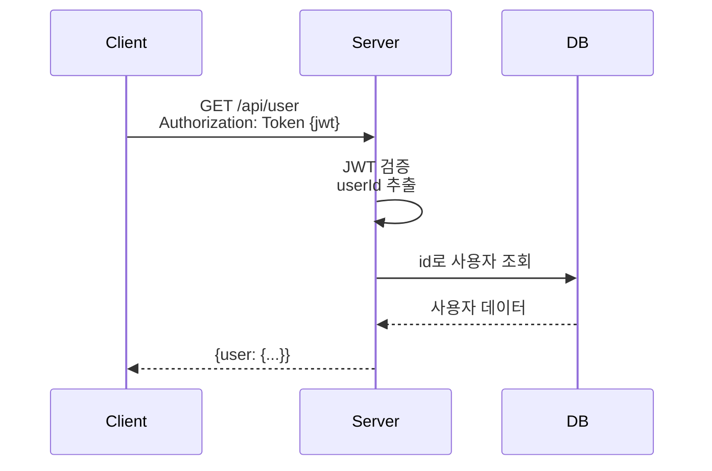

# RealWorld (Conduit) - 아키텍처 설계 문서

## 1. 시스템 개요

### 1.1 아키텍처 다이어그램



### 1.2 컴포넌트 간 통신

| 통신 경로             | 프로토콜      | 포맷        |
| --------------------- | ------------- | ----------- |
| 브라우저 ↔ 프론트엔드 | HTTP/HTTPS    | HTML/JS/CSS |
| 프론트엔드 ↔ 백엔드   | REST API      | JSON        |
| 백엔드 ↔ 데이터베이스 | Prisma Client | SQL         |

---

## 2. 백엔드 아키텍처

### 2.1 레이어드 아키텍처



### 2.2 레이어 책임

| 레이어           | 책임                           | 의존성       |
| ---------------- | ------------------------------ | ------------ |
| **Routes**       | 엔드포인트 정의, 미들웨어 적용 | Controllers  |
| **Controllers**  | HTTP 처리, 검증, 응답          | Services     |
| **Services**     | 비즈니스 로직                  | Repositories |
| **Repositories** | 데이터 액세스                  | Prisma       |

### 2.3 미들웨어 스택



---

## 3. 프론트엔드 아키텍처

### 3.1 기능 기반 모듈 구조

```
src/
├── features/                    # 기능 모듈
│   ├── auth/                    # 인증 기능
│   │   ├── components/          # 인증 관련 컴포넌트
│   │   ├── hooks/               # 인증 Hooks
│   │   ├── api/                 # 인증 API 호출
│   │   └── types.ts             # 타입 정의
│   │
│   ├── articles/                # 게시글 기능
│   │   ├── components/
│   │   ├── hooks/
│   │   ├── api/
│   │   └── types.ts
│   │
│   ├── comments/                # 댓글 기능
│   ├── profiles/                # 프로필 기능
│   └── tags/                    # 태그 기능
│
├── components/                  # 공유 컴포넌트
│   ├── layout/
│   │   ├── Header.tsx
│   │   ├── Footer.tsx
│   │   └── Layout.tsx
│   └── ui/
│       ├── Loading.tsx
│       ├── ErrorMessage.tsx
│       └── Pagination.tsx
│
├── hooks/                       # 공유 Hooks
│   ├── useAuth.ts
│   └── useLocalStorage.ts
│
├── lib/                         # 유틸리티
│   ├── api/
│   │   └── client.ts            # API 클라이언트
│   └── utils/
│       └── formatDate.ts
│
└── routes/                      # TanStack Router
    ├── __root.tsx
    ├── index.tsx
    ├── login.tsx
    ├── register.tsx
    └── ...
```

### 3.2 상태 관리 전략

| 상태 유형     | 관리 방법              | 예시                     |
| ------------- | ---------------------- | ------------------------ |
| **서버 상태** | TanStack Query         | 게시글 목록, 사용자 정보 |
| **인증 상태** | Context + localStorage | 로그인 상태, JWT         |
| **UI 상태**   | React State            | 모달, 폼                 |
| **URL 상태**  | TanStack Router        | 필터, 페이지 번호        |

### 3.3 데이터 페칭 패턴

```typescript
// useSuspenseQuery 패턴
function ArticleList() {
  const { data: articles } = useSuspenseQuery({
    queryKey: ['articles'],
    queryFn: () => api.articles.list()
  });

  return <ArticleListView articles={articles} />;
}

// Suspense Boundary
function ArticlesPage() {
  return (
    <Suspense fallback={<Loading />}>
      <ArticleList />
    </Suspense>
  );
}
```

---

## 4. 데이터 모델 (ERD)

### 4.1 엔티티 관계 다이어그램



### 4.2 Prisma 스키마

```prisma
// prisma/schema.prisma

generator client {
  provider = "prisma-client-js"
}

datasource db {
  provider = "sqlite"
  url      = env("DATABASE_URL")
}

model User {
  id        String   @id @default(uuid())
  email     String   @unique
  username  String   @unique
  password  String
  bio       String?
  image     String?
  createdAt DateTime @default(now())
  updatedAt DateTime @updatedAt

  // 관계
  articles   Article[]
  comments   Comment[]
  favorites  Favorite[]
  followers  Follow[]   @relation("Following")
  following  Follow[]   @relation("Follower")
}

model Article {
  id          String   @id @default(uuid())
  slug        String   @unique
  title       String
  description String
  body        String
  createdAt   DateTime @default(now())
  updatedAt   DateTime @updatedAt

  // 관계
  author    User       @relation(fields: [authorId], references: [id], onDelete: Cascade)
  authorId  String
  tags      ArticleTag[]
  comments  Comment[]
  favorites Favorite[]

  @@index([authorId])
  @@index([createdAt])
}

model Tag {
  id       String       @id @default(uuid())
  name     String       @unique
  articles ArticleTag[]
}

model ArticleTag {
  article   Article @relation(fields: [articleId], references: [id], onDelete: Cascade)
  articleId String
  tag       Tag     @relation(fields: [tagId], references: [id], onDelete: Cascade)
  tagId     String

  @@id([articleId, tagId])
}

model Comment {
  id        String   @id @default(uuid())
  body      String
  createdAt DateTime @default(now())
  updatedAt DateTime @updatedAt

  // 관계
  article   Article @relation(fields: [articleId], references: [id], onDelete: Cascade)
  articleId String
  author    User    @relation(fields: [authorId], references: [id], onDelete: Cascade)
  authorId  String

  @@index([articleId])
}

model Favorite {
  user      User    @relation(fields: [userId], references: [id], onDelete: Cascade)
  userId    String
  article   Article @relation(fields: [articleId], references: [id], onDelete: Cascade)
  articleId String

  @@id([userId, articleId])
}

model Follow {
  follower    User   @relation("Follower", fields: [followerId], references: [id], onDelete: Cascade)
  followerId  String
  following   User   @relation("Following", fields: [followingId], references: [id], onDelete: Cascade)
  followingId String

  @@id([followerId, followingId])
}
```

---

## 5. 인증 플로우

### 5.1 JWT 인증 시퀀스



### 5.2 인증된 요청



### 5.3 토큰 구조

```json
// JWT 페이로드
{
  "userId": "uuid-string",
  "iat": 1234567890,
  "exp": 1234567890
}
```

---

## 6. 에러 처리

### 6.1 에러 응답 포맷

```json
{
  "errors": {
    "body": ["can't be empty"]
  }
}
```

### 6.2 HTTP 상태 코드

| 코드 | 의미                  | 용도            |
| ---- | --------------------- | --------------- |
| 200  | OK                    | 성공 (GET, PUT) |
| 201  | Created               | 성공 (POST)     |
| 204  | No Content            | 성공 (DELETE)   |
| 400  | Bad Request           | 검증 오류       |
| 401  | Unauthorized          | 인증 필요       |
| 403  | Forbidden             | 권한 부족       |
| 404  | Not Found             | 리소스 없음     |
| 422  | Unprocessable Entity  | 검증 오류       |
| 500  | Internal Server Error | 서버 오류       |

### 6.3 백엔드 에러 처리

```typescript
// middleware/errorHandler.ts
export function errorHandler(err: Error, req: Request, res: Response, next: NextFunction) {
  if (err instanceof ValidationError) {
    return res.status(422).json({
      errors: err.errors,
    });
  }

  if (err instanceof UnauthorizedError) {
    return res.status(401).json({
      errors: { message: ['Unauthorized'] },
    });
  }

  // Sentry로 에러 전송
  Sentry.captureException(err);

  return res.status(500).json({
    errors: { message: ['Internal server error'] },
  });
}
```

---

## 7. 성능 최적화

### 7.1 백엔드

| 최적화                  | 구현                                   |
| ----------------------- | -------------------------------------- |
| **데이터베이스 인덱스** | 자주 쿼리되는 필드에 인덱스            |
| **N+1 문제 방지**       | Prisma include로 관련 데이터 일괄 조회 |
| **페이지네이션**        | offset/limit으로 데이터 조회 제한      |

### 7.2 프론트엔드

| 최적화           | 구현                             |
| ---------------- | -------------------------------- |
| **코드 분할**    | React.lazy + Suspense            |
| **캐싱**         | TanStack Query staleTime 설정    |
| **메모이제이션** | React.memo, useMemo, useCallback |
| **번들 최적화**  | Vite 청크 분할                   |

---

## 8. 보안 조치

### 8.1 보안 구현

| 위협               | 대응책                         |
| ------------------ | ------------------------------ |
| **XSS**            | React 이스케이핑, CSP 헤더     |
| **CSRF**           | SameSite Cookie (향후)         |
| **SQL 인젝션**     | Prisma ORM (파라미터화된 쿼리) |
| **무차별 대입**    | Rate Limiting (향후)           |
| **자격 증명 유출** | bcrypt 해싱, HTTPS             |

### 8.2 보안 헤더 (Helmet)

```typescript
app.use(
  helmet({
    contentSecurityPolicy: {
      directives: {
        defaultSrc: ["'self'"],
        styleSrc: ["'self'", "'unsafe-inline'"],
        scriptSrc: ["'self'"],
        imgSrc: ["'self'", 'data:', 'https:'],
      },
    },
  })
);
```
