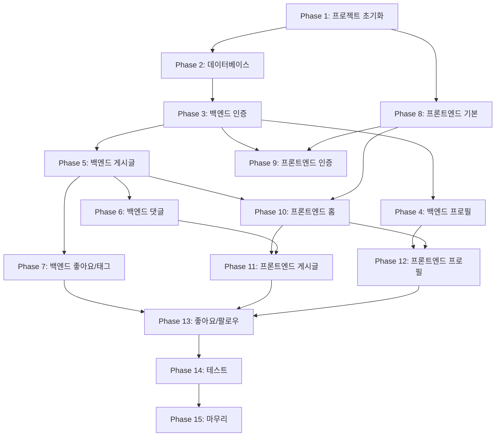

# RealWorld (Conduit) 구현 계획

## 개요

docs/ 폴더의 PRD, Architecture, TechStack, API-Spec 문서를 기반으로 한 구현 작업 계획입니다.

---

## Phase 1: 프로젝트 초기 설정

### Task 1.1: 모노레포 구조 설정
- [ ] pnpm-workspace.yaml 생성
- [ ] 루트 package.json 설정 (scripts: dev, build, test, lint, format)
- [ ] .gitignore 업데이트
- [ ] .prettierrc, .eslintrc.js 설정

### Task 1.2: 백엔드 프로젝트 초기화
- [ ] backend/ 디렉토리 생성
- [ ] package.json 설정 (Express, TypeScript, Prisma 등)
- [ ] tsconfig.json 설정
- [ ] src/ 디렉토리 구조 생성:
  ```
  backend/src/
  ├── routes/
  ├── controllers/
  ├── services/
  ├── repositories/
  ├── middleware/
  ├── lib/
  ├── types/
  └── index.ts
  ```

### Task 1.3: 프론트엔드 프로젝트 초기화
- [ ] frontend/ 디렉토리 생성
- [ ] Vite + React 19 + TypeScript 설정
- [ ] package.json 설정 (MUI, TanStack Query/Router 등)
- [ ] src/ 디렉토리 구조 생성:
  ```
  frontend/src/
  ├── features/
  ├── components/
  ├── hooks/
  ├── lib/
  ├── routes/
  ├── types/
  └── main.tsx
  ```

### Task 1.4: 환경 변수 설정
- [ ] backend/.env.example 생성
- [ ] frontend/.env.example 생성

---

## Phase 2: 데이터베이스 설정

### Task 2.1: Prisma 설정
- [ ] prisma/schema.prisma 생성 (Architecture.md의 ERD 기반)
- [ ] 모델 정의:
  - User (email, username, password, bio, image)
  - Article (slug, title, description, body, authorId)
  - Tag (name)
  - ArticleTag (articleId, tagId)
  - Comment (body, articleId, authorId)
  - Favorite (userId, articleId)
  - Follow (followerId, followingId)

### Task 2.2: 데이터베이스 마이그레이션
- [ ] 초기 마이그레이션 생성
- [ ] Prisma Client 생성
- [ ] lib/prisma.ts 유틸리티 생성

---

## Phase 3: 백엔드 인증 시스템 (Users API)

### Task 3.1: 인증 인프라
- [ ] lib/jwt.ts (토큰 생성/검증)
- [ ] middleware/auth.ts (JWT 검증 미들웨어)
- [ ] middleware/errorHandler.ts (에러 처리)
- [ ] middleware/validation.ts (Zod 검증)

### Task 3.2: 사용자 가입 (POST /api/users)
- [ ] UserRepository.create()
- [ ] userService.register()
- [ ] UserController.register()
- [ ] userRoutes 설정

### Task 3.3: 로그인 (POST /api/users/login)
- [ ] UserRepository.findByEmail()
- [ ] userService.login()
- [ ] UserController.login()

### Task 3.4: 현재 사용자 조회 (GET /api/user)
- [ ] userService.getCurrentUser()
- [ ] UserController.getCurrentUser()

### Task 3.5: 사용자 수정 (PUT /api/user)
- [ ] UserRepository.update()
- [ ] userService.updateUser()
- [ ] UserController.updateUser()

---

## Phase 4: 백엔드 프로필 API

### Task 4.1: 프로필 조회 (GET /api/profiles/:username)
- [ ] ProfileRepository / UserRepository.findByUsername()
- [ ] profileService.getProfile()
- [ ] ProfileController.getProfile()
- [ ] profileRoutes 설정

### Task 4.2: 팔로우 (POST /api/profiles/:username/follow)
- [ ] FollowRepository.create()
- [ ] profileService.followUser()
- [ ] ProfileController.followUser()

### Task 4.3: 언팔로우 (DELETE /api/profiles/:username/follow)
- [ ] FollowRepository.delete()
- [ ] profileService.unfollowUser()
- [ ] ProfileController.unfollowUser()

---

## Phase 5: 백엔드 게시글 API

### Task 5.1: 게시글 목록 조회 (GET /api/articles)
- [ ] ArticleRepository.findMany() (필터링, 페이지네이션)
- [ ] articleService.listArticles()
- [ ] ArticleController.listArticles()
- [ ] articleRoutes 설정

### Task 5.2: 피드 조회 (GET /api/articles/feed)
- [ ] ArticleRepository.findFeed()
- [ ] articleService.getFeed()
- [ ] ArticleController.getFeed()

### Task 5.3: 게시글 상세 조회 (GET /api/articles/:slug)
- [ ] ArticleRepository.findBySlug()
- [ ] articleService.getArticle()
- [ ] ArticleController.getArticle()

### Task 5.4: 게시글 작성 (POST /api/articles)
- [ ] ArticleRepository.create()
- [ ] TagRepository.findOrCreate()
- [ ] articleService.createArticle()
- [ ] ArticleController.createArticle()

### Task 5.5: 게시글 수정 (PUT /api/articles/:slug)
- [ ] ArticleRepository.update()
- [ ] articleService.updateArticle()
- [ ] ArticleController.updateArticle()

### Task 5.6: 게시글 삭제 (DELETE /api/articles/:slug)
- [ ] ArticleRepository.delete()
- [ ] articleService.deleteArticle()
- [ ] ArticleController.deleteArticle()

---

## Phase 6: 백엔드 댓글 API

### Task 6.1: 댓글 목록 조회 (GET /api/articles/:slug/comments)
- [ ] CommentRepository.findByArticle()
- [ ] commentService.getComments()
- [ ] CommentController.getComments()
- [ ] commentRoutes 설정

### Task 6.2: 댓글 작성 (POST /api/articles/:slug/comments)
- [ ] CommentRepository.create()
- [ ] commentService.createComment()
- [ ] CommentController.createComment()

### Task 6.3: 댓글 삭제 (DELETE /api/articles/:slug/comments/:id)
- [ ] CommentRepository.delete()
- [ ] commentService.deleteComment()
- [ ] CommentController.deleteComment()

---

## Phase 7: 백엔드 좋아요 & 태그 API

### Task 7.1: 좋아요 추가 (POST /api/articles/:slug/favorite)
- [ ] FavoriteRepository.create()
- [ ] articleService.favoriteArticle()
- [ ] ArticleController.favoriteArticle()

### Task 7.2: 좋아요 취소 (DELETE /api/articles/:slug/favorite)
- [ ] FavoriteRepository.delete()
- [ ] articleService.unfavoriteArticle()
- [ ] ArticleController.unfavoriteArticle()

### Task 7.3: 태그 목록 조회 (GET /api/tags)
- [ ] TagRepository.findPopular()
- [ ] tagService.getTags()
- [ ] TagController.getTags()
- [ ] tagRoutes 설정

---

## Phase 8: 프론트엔드 기본 설정

### Task 8.1: API 클라이언트 설정
- [ ] lib/api/client.ts (axios/fetch 래퍼)
- [ ] 인증 헤더 인터셉터
- [ ] 에러 핸들링

### Task 8.2: 라우터 설정
- [ ] TanStack Router 설정
- [ ] routes/__root.tsx
- [ ] 기본 라우트 파일 생성

### Task 8.3: 공통 컴포넌트
- [ ] components/layout/Layout.tsx
- [ ] components/layout/Header.tsx
- [ ] components/layout/Footer.tsx
- [ ] components/ui/Loading.tsx
- [ ] components/ui/ErrorMessage.tsx

### Task 8.4: 인증 Context
- [ ] hooks/useAuth.ts
- [ ] AuthContext (로그인 상태, 토큰 관리)

---

## Phase 9: 프론트엔드 인증 기능

### Task 9.1: 인증 API 연동
- [ ] features/auth/api/authApi.ts
- [ ] features/auth/hooks/useLogin.ts
- [ ] features/auth/hooks/useRegister.ts

### Task 9.2: 로그인 페이지
- [ ] routes/login.tsx
- [ ] features/auth/components/LoginForm.tsx

### Task 9.3: 회원가입 페이지
- [ ] routes/register.tsx
- [ ] features/auth/components/RegisterForm.tsx

### Task 9.4: 설정 페이지
- [ ] routes/settings.tsx
- [ ] features/auth/components/SettingsForm.tsx

---

## Phase 10: 프론트엔드 홈 페이지

### Task 10.1: 게시글 API 연동
- [ ] features/articles/api/articlesApi.ts
- [ ] features/articles/hooks/useArticles.ts
- [ ] features/articles/hooks/useFeed.ts

### Task 10.2: 태그 API 연동
- [ ] features/tags/api/tagsApi.ts
- [ ] features/tags/hooks/useTags.ts

### Task 10.3: 홈 페이지 컴포넌트
- [ ] routes/index.tsx
- [ ] features/articles/components/ArticleList.tsx
- [ ] features/articles/components/ArticlePreview.tsx
- [ ] features/articles/components/FeedTabs.tsx
- [ ] features/tags/components/PopularTags.tsx
- [ ] components/ui/Pagination.tsx

---

## Phase 11: 프론트엔드 게시글 기능

### Task 11.1: 게시글 상세 페이지
- [ ] routes/article/$slug.tsx
- [ ] features/articles/components/ArticleDetail.tsx
- [ ] features/articles/components/ArticleMeta.tsx
- [ ] features/articles/hooks/useArticle.ts

### Task 11.2: 게시글 작성/수정 페이지
- [ ] routes/editor/index.tsx
- [ ] routes/editor/$slug.tsx
- [ ] features/articles/components/ArticleEditor.tsx
- [ ] features/articles/hooks/useCreateArticle.ts
- [ ] features/articles/hooks/useUpdateArticle.ts

### Task 11.3: 댓글 기능
- [ ] features/comments/api/commentsApi.ts
- [ ] features/comments/components/CommentList.tsx
- [ ] features/comments/components/CommentForm.tsx
- [ ] features/comments/hooks/useComments.ts

---

## Phase 12: 프론트엔드 프로필 기능

### Task 12.1: 프로필 API 연동
- [ ] features/profiles/api/profilesApi.ts
- [ ] features/profiles/hooks/useProfile.ts
- [ ] features/profiles/hooks/useFollow.ts

### Task 12.2: 프로필 페이지
- [ ] routes/profile/$username.tsx
- [ ] routes/profile/$username/favorites.tsx
- [ ] features/profiles/components/ProfileHeader.tsx
- [ ] features/profiles/components/ProfileArticles.tsx

---

## Phase 13: 좋아요 & 팔로우 기능

### Task 13.1: 좋아요 기능
- [ ] features/articles/hooks/useFavorite.ts
- [ ] 게시글 카드/상세에 좋아요 버튼 연동

### Task 13.2: 팔로우 기능
- [ ] features/profiles/hooks/useFollow.ts
- [ ] 프로필/게시글에 팔로우 버튼 연동

---

## Phase 14: 테스트 및 품질 보증

### Task 14.1: 백엔드 테스트
- [ ] API 엔드포인트 통합 테스트 (Supertest)
- [ ] Service 레이어 유닛 테스트

### Task 14.2: 프론트엔드 테스트
- [ ] 컴포넌트 테스트 (Testing Library)
- [ ] Hook 테스트

### Task 14.3: E2E 테스트 (선택)
- [ ] 주요 사용자 플로우 테스트

---

## Phase 15: 마무리

### Task 15.1: 문서 업데이트
- [ ] README.md 업데이트
- [ ] API 문서 최종 검증

### Task 15.2: 성능 최적화
- [ ] 프론트엔드 번들 최적화
- [ ] 백엔드 쿼리 최적화

### Task 15.3: 에러 모니터링
- [ ] Sentry 설정 (선택)

---

## 의존성 그래프



---

## 예상 작업량

| Phase | 설명 | 예상 Task 수 |
|-------|------|-------------|
| 1 | 프로젝트 초기화 | 4 |
| 2 | 데이터베이스 | 2 |
| 3 | 백엔드 인증 | 5 |
| 4 | 백엔드 프로필 | 3 |
| 5 | 백엔드 게시글 | 6 |
| 6 | 백엔드 댓글 | 3 |
| 7 | 백엔드 좋아요/태그 | 3 |
| 8 | 프론트엔드 기본 | 4 |
| 9 | 프론트엔드 인증 | 4 |
| 10 | 프론트엔드 홈 | 3 |
| 11 | 프론트엔드 게시글 | 3 |
| 12 | 프론트엔드 프로필 | 2 |
| 13 | 좋아요/팔로우 | 2 |
| 14 | 테스트 | 3 |
| 15 | 마무리 | 3 |
| **Total** | | **50 Tasks** |

---

## 권장 구현 순서

1. **Phase 1-2**: 프로젝트 기반 설정
2. **Phase 3-7**: 백엔드 API 전체 구현
3. **Phase 8**: 프론트엔드 기반 설정
4. **Phase 9-13**: 프론트엔드 기능 구현
5. **Phase 14-15**: 테스트 및 마무리

백엔드 API를 먼저 완성한 후 프론트엔드를 구현하면 API 테스트와 프론트엔드 개발을 병행할 수 있습니다.
